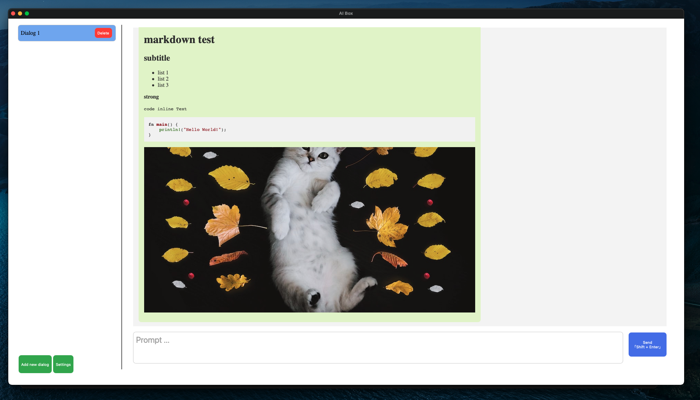

# AIBOX

AIBOX is a desktop application for AI tool interaction. 

The project is currently in the **demo** implementation phase.

## RoadMap

demo phase:

- [x] Support Markdown Message
- [ ] Config API
- [ ] Socket Proxy

--- 

future:

- [ ] History Save && Share
- [ ] GPT4
- [ ] StableDiffusion

## License

This project is licensed under the Apache License 2.0 and the MIT License.